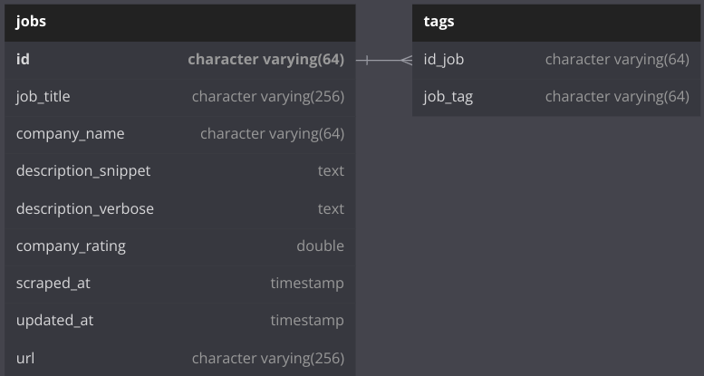

# Indeed offers

This project aims to collect indeed job offers and store it in a database.

We will be using **python** and the selenium package to scrap data from the *indeed* website and store the data in a **PostgreSQL** database.

It is worth noting that this project has been built using `linux`.

## Documentation

[Python documentation](https://vinthara.github.io/indeed_offers/)

## Installation 

[Getting started with PostgreSQL and setting up service connection file](GETTING_STARTED.md)

## Populate sql tables, functions, triggers




```shell
export PGSERVICEFILE=.pg_service.conf
```

Populate the tables : 

```
psql "service=offers" < sql/tables/create_tables.sql 
```

Populate the functions :

```shell
psql "service=offers" < sql/functions/scraped_stats.sql 
psql "service=offers" < sql/functions/update_timestamp_on_updates.sql
```

Populate the triggers : 

```shell
psql "service=offers" < sql/triggers/trigger_jobs.sql
```

## Create a python virtual environment

Create a `venv` environment and activate it :

```shell
python3 -m venv venv
source venv/bin/activate
```

Install the dependencies : 

```shell
pip3 install -r requirements.txt
```

Few things to notice before launching `indeed_scraping.py` script :

>In the `__name__ == '__main__'` part : 
>If you don't want to open the google chrome browser, set the boolean to `True` : 

```python
soup_list = scrap_offer_indeed(list_keyword, offer_age, indeed_country, False)
"""
...
...
"""
df_description = scrap_indeed_description(id_offers_to_scrap, url_offers_to_scrap, False)
```

> You can also set up the amount of scraping you want to do in the `for i in range(10):`
> You can edit the number in the for loop

Launch the `indeed_scraping.py` script :

```python
python3 indeed_scraping.py
```

Get `jobs` table stats :

```shell
psql "service=offers" -c "SELECT scraped_stats();"
```

Output : 

```json
{
    "scraped": 30,
    "total_jobs": 977,
    "scrap_progress": 0.03,
    "to_scrap": 947
}
```

Get `jobs` table output :

```shell
psql "service=offers" -c "SELECT id, job_title, company_name, company_rating, scraped_at, url from jobs limit 1"
```

Ouput : 

| id               | job_title                | company_name     | company_rating | scraped_at          | url                                               |
| ---------------- | ------------------------ | ---------------- | -------------- | ------------------- | ------------------------------------------------- |
| 5143d988833fff26 | Procurement Data Analyst | PCL Construction | 3.8            | 2023-01-03 17:38:41 | https://ca.indeed.com/viewjob?jk=5143d988833fff26 |
